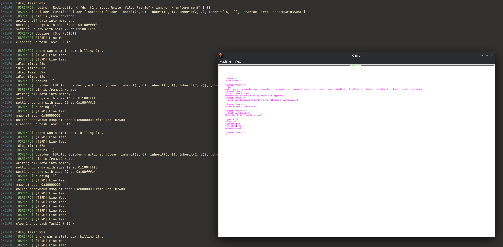

# TinyOS

> yet another hobby OS written for fun



## Overview

TinyOS is a modular monolithic, preemptive, 64-bit hobby OS written from scratch that loosely follows the UNIX philosophy of *"everything is a file"* and shares some core similarities with its ABI.

### Key Characteristics
* **Architecture:** Modular monolithic design with a preemptive scheduler.
* **Userspace Environment:** Programs are loaded at compile time from `tinyosprograms` into a custom RamFS.
* **Ergonomic Development:** Userspace applications can be easily built using standard recipes found in `tinyosprograms/programs/example-*`.

### Ecosystem Libraries
* `libtinyos`: A custom library providing an ergonomic interface wrap around the `tinyos_abi`.
* `libtinygraphics`: A graphics library allowing integration with TinyOS's exposed framebuffers, featuring out-of-the-box support for **Ratatui** terminal UIs.

---

## How to use this?

### Quickstart

Using Docker:

```bash
docker build -t tinyos .
docker run -it --rm -p 8080:8080 tinyos
```

Then open your browser on `http://localhost:8080/vnc.html` and press `Connect`.

Running locally:

```bash
make run RUST_PROFILE=release
```

### Dependencies

* **Build System:** Any `make` command depends on GNU make (`gmake`) and is expected to be run using it. This usually means using `make` on most GNU/Linux distros, or `gmake` on other non-GNU systems.
* **Toolchain:** All `make all*` targets require a working **Rust** installation.
* **Image Generation:** * Building an ISO (`make all`) requires `xorriso`.
  * Building an HDD/USB image (`make all-hdd`) requires `sgdisk` (usually from `gdisk`/`gptfdisk` packages) and `mtools`.

### Architectural targets

The `KARCH` make variable determines the target architecture to build the kernel and image for.

The default `KARCH` is `x86_64`. Other options include: `aarch64`, `riscv64`, and `loongarch64`.

Currently only `x86_64` is supported.

### Makefile targets

| Target | Description |
| :--- | :--- |
| **`make all`** | Compiles the kernel and generates a bootable ISO image. |
| **`make all-hdd`** | Compiles the kernel and generates a raw image suitable for USB flashing or HDDs. |
| **`make run`** | Builds the bootable ISO and launches it via QEMU. |
| **`make run-hdd`** | Builds the raw HDD image and launches it via QEMU. |
| **`make test`** | Builds the kernel with `test_run` features enabled and executes tests. |
| **`make debug`** / **`debug-test`** | Launches QEMU with debugging flags (`-s -S -d int,guest_errors`) for attaching a debugger. |

### Makefile Variables

Fine-tune your build by passing variables directly to `make`:

* `QEMUFLAGS`: Append custom flags to the QEMU instance.
* `CARGO_FLAGS`: Pass extra arguments down to Cargo.
* `RUST_PROFILE`: Switch profiles (e.g., `dev` vs `release`).
* `CARGO_TARGET_DIR` / `KERNEL_BIN` / `IMAGE_NAME`: Override default output paths and file names.

## Supported architectures

x86-64 (default)

currently no real hardware is supported

## Acknowledgements

Early foundations of TinyOS were inspired and influenced by these excellent community resources:
* [OSDev Wiki](https://wiki.osdev.org/) - A great wiki, containing all kinds of information for kernel development
* [Philipp Oppermann's Blog](https://os.phil-opp.com/) - A great guide for getting started with Rust OsDev
